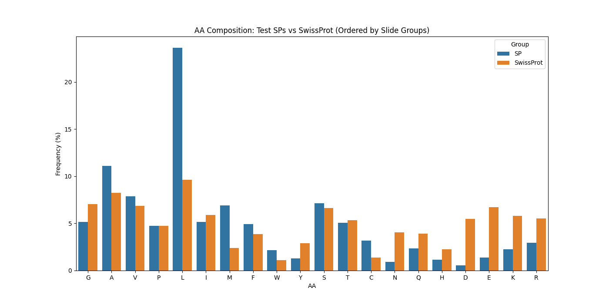
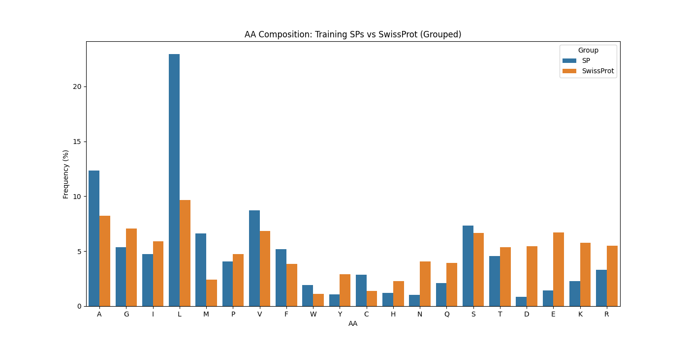
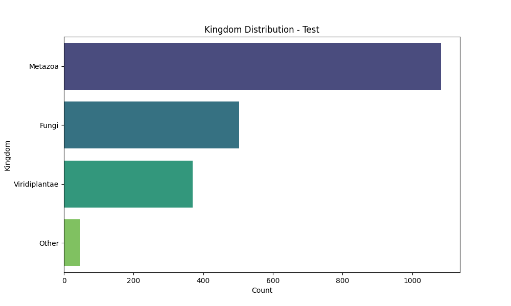
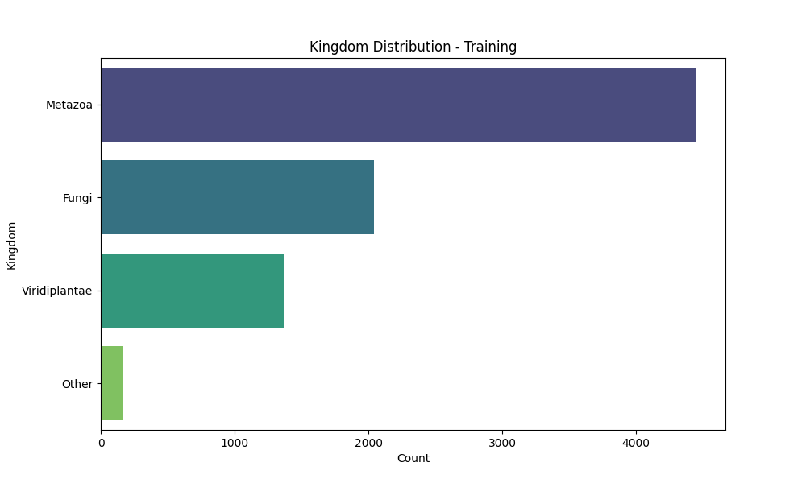
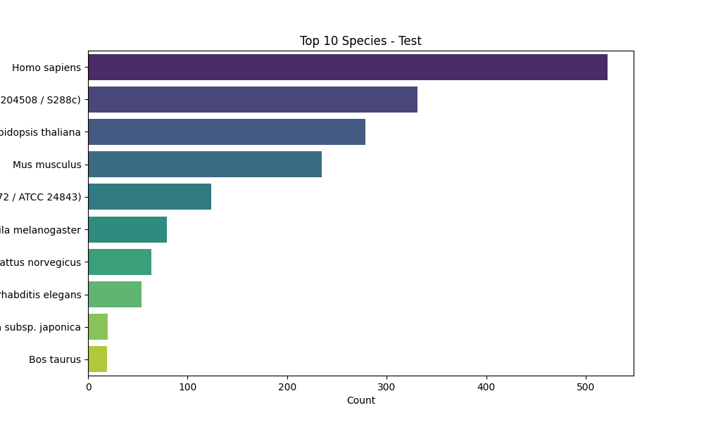
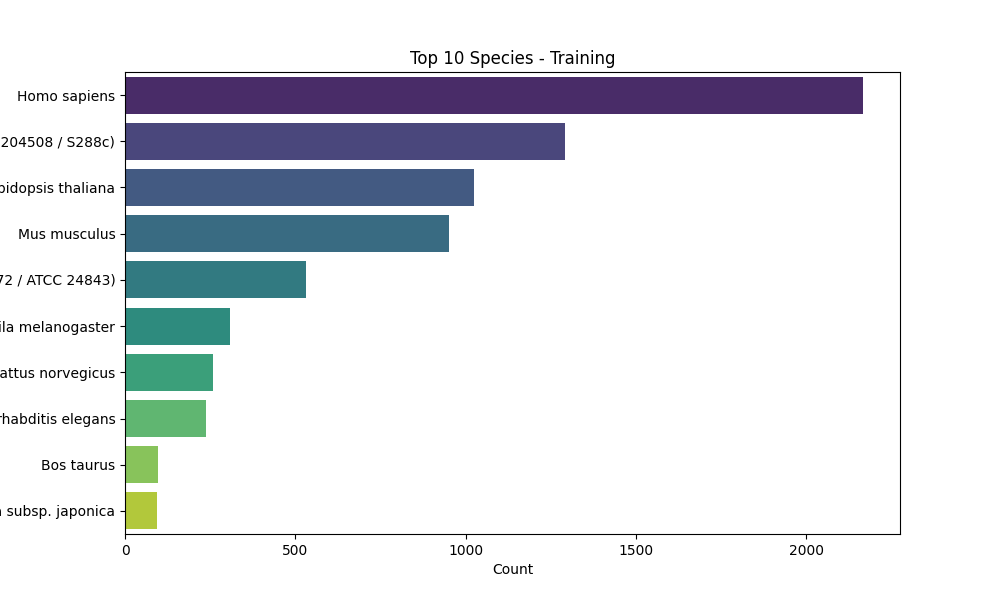

<h1 style="color: #0366d6; border-bottom: 2px solid #eaecef; padding-bottom: 6px;">Data Analysis of Signal Peptides</h1>

This repository contains the work carried out for the Data Analysis. The goal was to analyze datasets of proteins with and without signal peptides, perform descriptive statistical analyses, and visualize key features such as sequence lengths, amino acid compositions, taxonomic distribution, and cleavage site motifs.

<h2 style="color: #22863a; border-bottom: 1px solid #eaecef;">Workflow and Steps</h2>

<h3 style="color: #6f42c1;">1. Dataset Retrieval</h3>

We retrieved the datasets from <strong>UniProtKB/SwissProt</strong>, selecting proteins annotated with a signal peptide (positive set) and proteins without signal peptides (negative set). The data was downloaded in TSV format and included metadata such as:

<ul style="margin-left: 20px;">
  <li>Accession</li>
  <li>Organism</li>
  <li>Kingdom</li>
  <li>Sequence length</li>
  <li>Signal peptide cleavage site</li>
</ul>

This gave us a clear starting point with both positive and negative examples for further analysis.

<h3 style="color: #6f42c1;">2. Data Preprocessing</h3>

The raw dataset was curated to ensure quality:

<ul style="margin-left: 20px;">
  <li>Removed redundant entries and incomplete sequences.</li>
  <li>Verified that both positive and negative datasets were properly balanced.</li>
  <li>Added a <code style="background-color: #f6f8fa; padding: 2px 5px; border-radius: 4px;">fold</code> column to split the data into 5 partitions for cross-validation.</li>
</ul>

After preprocessing, the dataset was ready for statistical analysis.

<h3 style="color: #6f42c1;">3. Protein Length Distribution</h3>

The first descriptive analysis compared the lengths of proteins containing signal peptides against those without. A histogram/density plot was generated to visualize the distribution.

The analysis showed that signal peptide-containing proteins were, on average, slightly longer than proteins without SPs. This confirmed the expectation that secretory proteins tend to have longer sequences.

<h3 style="color: #6f42c1;">4. Signal Peptide Length Distribution</h3>

We then focused on the signal peptides themselves:

<ul style="margin-left: 20px;">
  <li>Extracted SP regions from the positive dataset.</li>
  <li>Produced a histogram of SP lengths.</li>
</ul>

The distribution centered around <strong>~20–25 amino acids</strong>, with most SPs falling within this narrow range. This is consistent with known biology, as signal peptides are typically short hydrophobic sequences that guide protein secretion.

<h3 style="color: #6f42c1;">5. Amino Acid Composition Analysis</h3>

To understand compositional biases, we compared amino acid frequencies in SPs against the background amino acid distribution of SwissProt:

<ul style="margin-left: 20px;">
  <li>Calculated amino acid usage across all SPs.</li>
  <li>Downloaded SwissProt composition statistics from Expasy.</li>
  <li>Created a combined barplot for comparison.</li>
</ul>

<strong>Findings:</strong>

<ul style="margin-left: 20px;">
  <li>SPs are enriched in hydrophobic residues such as <strong>L, I, V, A, F, and M</strong>.</li>
  <li>Polar and charged residues were under-represented.</li>
</ul>

This matched the expected hydrophobic character of SPs.

<h3 style="color: #6f42c1;">6. Taxonomic Classification</h3>

We analyzed the dataset by <strong>Kingdom</strong> and <strong>Species</strong>:

<ul style="margin-left: 20px;">
  <li>Grouped proteins by taxonomy and plotted their frequencies.</li>
</ul>

At the kingdom level, SP-containing proteins appeared across <em>Bacteria</em>, <em>Eukaryota</em>, and <em>Archaea</em>, with <strong>Eukaryotes</strong> dominating the dataset.

At the species level, the dataset showed a broad distribution, confirming it was not biased toward a single organism.

We used barplots for clarity.

<h3 style="color: #6f42c1;">7. Cleavage Site Sequence Logos</h3>

Finally, we examined the signal peptide cleavage sites:

<ul style="margin-left: 20px;">
  <li>Extracted regions from <code style="background-color: #f6f8fa; padding: 2px 5px; border-radius: 4px;">-13</code> to <code style="background-color: #f6f8fa; padding: 2px 5px; border-radius: 4px;">+2</code> around the cleavage position.</li>
  <li>Aligned these subsequences.</li>
  <li>Submitted the alignment to <a href="https://weblogo.berkeley.edu" target="_blank" style="color: #0366d6; text-decoration: none;">WebLogo</a> to generate a sequence logo.</li>
</ul>

The resulting logo highlighted:

<ul style="margin-left: 20px;">
  <li>Strong conservation of <strong>Alanine (A)</strong> at position <strong>-1</strong>.</li>
</ul>

This observation matches <strong>von Heijne’s rules</strong>, which describe conserved residues around cleavage sites.

